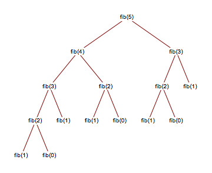
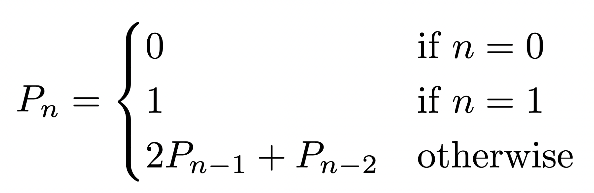

# Programming II

## Lab 8: Recursion Practice

In this lab, you will practice writing recursive functions. Please take your time and think it through -- recursion is notoriously tricky! Drawing out the recursive calls is also highly recommended.

### Attribution

This lab is used in CS 222 at Saint Mary's College of California.

Some of the starter code, and a good chunk of JUnit test cases used comes from Dr. Chris Bourke's "[Lab 08](https://github.com/cbourke/CSCE156-Lab08)", which is used in CSCE 156 (Computer Science II) at the University of Nebraska-Lincoln.

## Instructions

1. Clone this lab from Github. Use this link: <https://github.com/sroscoe2/CS222-Lab-08.git> Refer to Lab 1 if you need a refresher for how to do so. REMEMBER: when importing, name your folder `firstnameLIpartnerLI-CS222-Lab-08`

### Fibonacci

2. [About Fibonacci](#fibonacci-numbers) Open `Fibonacci.java`. Write a [naive](#fibonacci----naive) recursive implementation in the `naiveFib()` method, to compute the `n`th Fibonacci number. Assume that the 0th and 1st Fibonacci numbers are 1 and 1.

3. Test your method in the main method provided. Try with small numbers and big numbers. Is it efficient?

4. [About HashMaps](#hashmap) [About BigIntegers](#bigintegers) Create a field for the `Fibonacci` class that is a `Map`. You may declare and instantiate the HashMap as a field all in one line like so: `private static Map<Integer, BigInteger> fibMap = new HashMap<>();`

5. [Explanation](#fibonacci----memoization) Implement the `memoFib()` method, to the following specifications:

    a. If the parameter `n` does not satisfy the base case, it should be checked if `n` is part of the HashMap. You can so so by calling `BigInteger fibNumber = fibMap.get(n)`.
  
    b. If `fibNumber` is *not* null, then it is already in the map and the value should simply be returned.
  
    c. If `fibNumber` *is* null, then it is not part of the map, and you must calculate it recursively, and save it to the variable called `fibNumber`. Once you do so, you must put it in the map using `fibMap.put(n,fibNumber)` Then return `fibNumber`.

6. Test your method in the main method provided. Try with small numbers and big numbers. Is it efficient?

7. Run `RecursionTests.java` in the `test` package and ensure all the Fibonacci-related test cases pass.

### Pell

8. Read up on [Pell numbers](#pell-numbers). Then implement a memoized recursive function that calculates the `n`th Pell number.

9. Run `RecursionTests.java` in the `test` package and ensure all the Pell-related test cases pass.

### Palindrome

10. Read up on [Palindromes](#palindromes). Then, write a recursive method that figures out if a given word is a palindrome.

11. Run `RecursionTests.java` in the `test` package and ensure all palindrome-related test cases pass.

## Explanations

### Fibonacci Numbers

A Fibonacci number is a number that can be found in the Fibonacci sequence. This sequence begins with the numbers `1, 1, 2, 3, 5, 8, 13, 21, ...` and can be continued by adding the last two numbers of the sequence together.

It is our goal to write an efficient, recursive function to compute the `n`th number in the sequence. In general, we can say that

```txt
Fib(n) = Fib(n-1) + Fib(n-2)
```

Or, in words, we can find the `n`th Fibonacci number by adding the two previous numbers.

You will solve this problem in two ways:

1. Naive recursion
2. Memoization

[Go back to the instructions](#fibonacci)

#### Fibonacci -- Naive

Naive recursion is perhaps the most intuitive way to approach this problem. It involves a pure recursive call, nothing extra. The only contents of your naive recusive method should be the base case and the recursive call.

[Go back to the instructions](#fibonacci)

#### Fibonacci -- Memoization

You will find that using only a naive implementation is very slow. But if we completed this problem iteratively, it would be very fast. We can still attain this speed by working recursively -- we just have to add something on.

We will solve the issue by using a process called *memoization* (not *memo**r**ization, that's something different).

Memoization is the action of writing things down as we proceed through the recursive calls. We do this because there is too much repeated calculations when we execute the naive function:

<p align="center">

</p>

[Go back to the instructions](#fibonacci)

#### HashMap

To solve these problems, we will have some piece of data that holds items independent of the recursive method. We'll do this with a static field, a HashMap.

A HashMap is kind of like a Python dictionary, where there are key-value pairs. You can access the value by providing its key.

Main operations:

- `ourMap.get(k)`: gets the value associated with key `k`.
- `ourMap.put(k,v)`: puts a new key-value pair in the map.

If we try to get a key that does not exist in the map, it will return `null`.

Your job is to modify the naive solution to check first if a Fibonacci number has already been computed. If you already computed it, just return it. If you haven't computed it, make the recursive call to do so.

[Go back to the instructions](#instructions)

#### BigIntegers

When working with really big numbers, `int`s and `long`s don't make the cut. They can overflow very quickly. This means we need to bring in a new type to help us along.

Enter: `BigInteger`.

This is a type that is designed to hold big numbers. Take a look at the [documentation](https://docs.oracle.com/en/java/javase/17/docs/api/java.base/java/math/BigInteger.html) to see what may be of interest.

Things you might want to use:

- To declare/instantiate: `BigInteger myvarname = new BigInteger(someIntHere);`
- To get 1: `BigInteger.ONE`
- To get 2: `BigInteger.TWO`
- To add two `BigInteger`s together: `a.add(b)`
- To multiply two `BigInteger`s together: `a.multiply(b)`

[Go back to the instructions](#instructions)

### Pell Numbers

[Pell numbers](https://en.wikipedia.org/wiki/Pell_number) are another type of mathematical sequence. They are defined by the following equation:

<p align="center">

</p>

In words, the 0th Pell number is 0. The first Pell number is 1. Subsequent Pell numbers are obtained by doubling the immediately previous number, then adding the one occurring before that.

You should use the same strategy as memoized Fibonacci to determine a specified Pell number.

First, decide what the base case should be.

Then, get the `i`th Pell number from the map. If it's not `null`, return it.

If the `i`th Pell number is `null`, recursively calculate it. Then, map `i` to its value (the actual Pell number). Simply modify the equation from what you did in Fibonacci.

[Go back to the instructions](#pell)


### Palindromes

A palindrome is a word that reads the same backwards and forwards.

Here are some of my favorite palindromes:

1. racecar
2. plural
3. civic
4. machine
5. people
6. tacocat
7. aibohphobia
8. tense
9. plant
10. deleveled
11. rotator

Your job is to devise a recursive way to check if a given word is a palindrome, e.g. the same backwards and forwards. You *should not* just use `==` or `.equals()`. Your method must be recursive.

Hint: use String methods like `.substring()` or `.charAt()`.

[Go back to the instructions](#palindrome)
